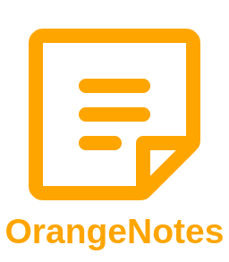

   
  
  
Uma plataforma web para registrar e organizar todo seu conhecimento! 🚀

   

  
  
  

 

Acesse o projeto: <a href="https://orangenotes.vercel.app/">orangenotes.vercel.app</a>

 
 

 <a href="#visao">Visão Geral</a> •
 <a href="#features">Features</a> • 
 <a href="#demo">Demonstração</a> • 
 <a href="#tecnologias">Tecnologias</a> • 
 <a href="#licenca">Licença</a> • 
 <a href="#autor">Autor</a>

 
  

  <h2>Visão Geral</h2>
  
OrangeNotes é uma plataforma web focada em trazer uma melhor experiência para seus processos de aprendizado, otimizando a maneira que você registra e organiza seu conhecimeto. ORGANIZE seus cursos, vídeo aulas, artigos, e qualquer outro assunto que desejar, de forma fácil e rápida. Além disso, VEJA SEU PROGRESSO através dos níveis de gameficação. 🚀 

 

  <h2>Features</h2>
  <ul>
    <li>
      
Autenticação de usuário (Login e Cadastro)

    </li>
    <li>
      
Criar "Blocos" de anotações para melhor organizá-las, além poder editar ou excluir os mesmos.

    </li>
    <li>
      
Adicionar, editar ou excluir anotações nos "Blocos"

    </li>
    <li>
      
Adicionar "Tags" como marcadores para os "Blocos"

    </li>
    <li>
      
Pesquisar os "Blocos" por "Tags", a fim de encontrá-los ainda mais facilmente

    </li>
    <li>
      
Níveis de gameficação, e aumento da "Pontuação" a medida que o usuário progride em registrar seu conhecimento

    </li>
  </ul>

 

  <h2>Demonstração Da Aplicação</h2>
  

    <h3>Desktop<h3>
    
  

  
   
  
   

    <h3>Mobile Devices<h3>
    
  

 

  <h2>Tecnologias Utilizadas</h2>
  
Contrução da interface e lógica da aplicação:

  
  
  
Banco de dados e serviços de authenticação de usuários:

  
  
Outras ferramentas/libs:

  <ul>
    <li>
      <a href="https://github.com/fkhadra/react-toastify">React-Toastify</a>
    </li>
    <li>
      <a href="https://github.com/phosphor-icons/phosphor-home">Phosphor Icons</a>
    </li>
  </ul>

 

  <h2>Licença</h2>
  
Acesse a licença da aplicação:

  

  <h2>Autor</h2>
  
  
Hudson Santos

  
👋🏽 Entre em contato!

 

